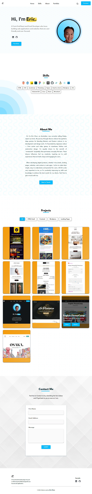
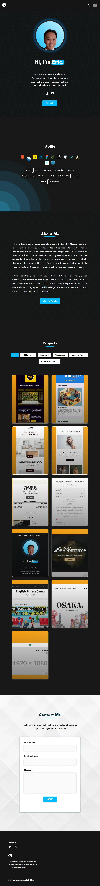

## Eric Chun Frontend Portfolio Website

This is my personal portfolio website built with React, showcasing my work and skills as a Digital Content and Marketing Lead, Growth Marketer, and Front-End React Web Developer. 

You can view it live at:

www.ecdevportfolio.com.

 

### Project Status

Live and actively maintained

 

### Project Screen Shots

  

 
<h5>Dark Mode</h5>

  

 

### Installation and Setup Instructions

This portfolio is hosted online, so you can view it directly by navigating to:
www.ecdevportfolio.com.

### Reflection

<h4>Context:</h4>
I built this portfolio as a personal project to showcase my skills and work as a Digital Content and Marketing Lead, Growth Marketer. It’s a platform I use to demonstrate my expertise to potential clients and hiring managers.

<h4>Objective:</h4>
My goal was to create a visually appealing, responsive, and user-friendly site that highlights my work and skills while reflecting my personal style. I wanted to emphasize the blend of Western and Eastern design elements that are part of my identity.

<h4>Challenges:</h4>
There were many challenges with this project that I couldn't have forseen but managed to overcome with a lot of trial and error, thinking, Googling and AI help.
 
 
How do you insert a custom responsive slider that brings in dynamic information?
 
How do you add analytics to a website?
 
How do you optimize the website for better performance?
 
How do you create customized animations with only css?
 
How do I create a dark mode feature and save it in local storage?
 
How do I build a custom form so any can contact me, then validate the data then send the information to a safe third party API email message provider?
 
 
I also spent a significant amount of time making sure the website was responsive and performs well across devices and browsers.

 

### Tools and Technologies:

- React
- JavaScript
- HTML5
- CSS3
- Vercel (For Deployment)
